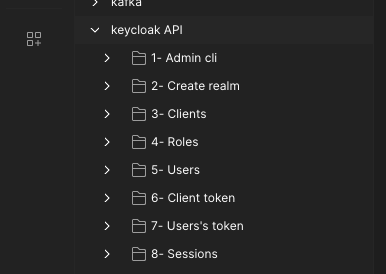
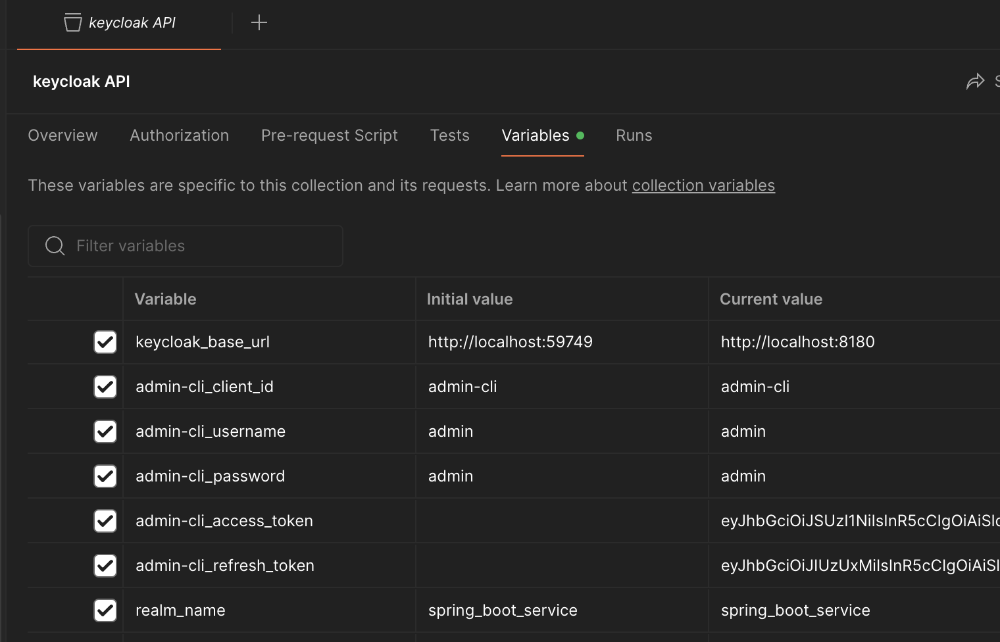

# Demo for using spring boot application with keycloak OIDC

### Default env variables configured in pom.xml:
- KEYCLOAK_BASE_URL: http://localhost:8180
- KEYCLOAK_REALM_NAME: spring_boot_service
- KEYCLOAK_CLIENT_ID: spring_boot_service_client
- KEYCLOAK_CLIENT_SECRET: HmoDZeRFplZzcshdVKCF9IqczDj1cFBw

### Used technologies and importante dependencies (See  [docker-compose](./docker-compose.yml) and [pom.xml](./pom.xml))
- Docker (You need to have docker installed)
- Java: <b>17</b>
- spring boot: <b>3.2.6</b>
- spring-boot-starter-security
- spring-boot-starter-oauth2-client
- spring-boot-starter-oauth2-resource-server
- testcontainers-keycloak for IT
- <b>Keycloak</b> image (for keycloak server): <b>quay.io/keycloak/keycloak:24.0.5</b>
- <b>Postgres</b> image postgres (to store keycloak data (users, roles, etc)): <b>14-alpine</b>

### Start the application
Before start spring boot application we must start keycloak server ans postgres db.

#### run docker compose to start keycloak and postgres
```console
docker-compose -f docker-compose.yml up
```

#### run spring boot application
You can modify default env variables in pom.xml for (KEYCLOAK_BASE_URL, KEYCLOAK_REALM_NAME, KEYCLOAK_CLIENT_ID and KEYCLOAK_CLIENT_SECRET)

Then run 
```console
mvn spring-boot:run
```
### Postman section 
Postman is used to interact with Keycloak server. The file keycloak_API.json contains the queries needed to configure Keycloak. 
- Go to postman and import file ==> ([keycloak_API.json](./keycloak/postman/keycloak_API.json))
- After importing, you will get a new collection (Keycloak API) with several sub-folders like in the picture bellow 



<ol>
  <li> <i><b>Admin cli: </b></i> Contains requests to make to get and refresh access token for admin keycloak user. admin-cli token is used after to manage realms, roles, clients and users. </li>
  <li> <i><b>Create realm: </b></i> Requests to create a new realm and get a realm list </li>
  <li> <i><b>Clients: </b></i> Client's requests to create and retrieve clients list </li>
  <li> <i><b>Roles: </b></i> Endpoints to create and get realm roles (ADMIN and USER roles) </li>
  <li> <i><b>Users: </b></i> In this folder you have requests to create and assign roles to users (admin and user)</li>
  <li> <i><b>Client token: </b></i> The folder contains request to get a new access token for the client created in step 3.</li>
  <li> <i><b>Users' token: </b></i> Requests to get a new access and refresh token for user and admin users.</li>
  <li> <i><b>Sessions: </b></i> Queries regarding keycloak sessions.</li>
</ol>

- The imported file will also create a collection variables like shown bellow.


  
-  In this collection variables you have variable (like keycloak_base_url, username and password for admin-cli, realm_name to create) with default values. You can modify them if necessary.
<ol>
  <li> <i><b>keycloak_base_url: </b></i>Keycloak server host.</li>
  <li> <i><b>admin-cli_username and admin-cli_password: </b></i>Keycloak admin username and password</li>
  <li> <i><b>realm_name: </b></i>Realm name to create</li>
  <li> <i><b>client_id, client_name and client_secret: </b></i>To specify the client to create in keycloak server</li>
  <li> <i><b>admin_role, user_role: </b></i>By default admin_role=ADMIN, user_role=USER. But it remains configurable</li>
  <li> <i><b>my_admin_username, my_admin_password, my_user_username, my_user_password: </b></i>To indicate the username and password for admin and user users</li>
</ol>

### Test spring boot application
The application contains some protected routes with role management.<br>
To test these routes we need to do some additional configuration in keycloak.
The command executed previously ```docker-compose -f docker-compose.yml up``` has already created the realm, the client and realm roles (ADMIN and USER)<br>
After, we have to create users (user and admin), and assign them USER and ADMIN roles. for this you can use the requests imported previously into postman :
<ol>
    <li>Go to folder <b>(1- Admin cli)</b> and run the request (1- Token admin-cli) to get a new access token for admin keycloak user</li>
    <li>Go to folder <b>4- Roles</b> and run request (3- Get realm roles)</li>
    <li>Go then to the folder <b>(5- Users)</b> and run the requests from 1 to 5 <b>(Create user (admin), Create user (simple_user), Get All users, Assign role to user (ADMIN), Assign role to user (USER))</b></li>
    <li>After, you can go to <a href="http://localhost:8081/swagger-ui/index.html">Swagger interface</a> and test to connect with the two created users (username: user, password: 1234 OR username: admin, password: 1234)</li>
    <li>Try to access to application routes with the generated access_token</li>
</ol>

### Keycloak admin interface
Keycloak admin interface is available on [link](http://localhost:8180/admin/master/console).
You can connect with user: admin, password:admin 


